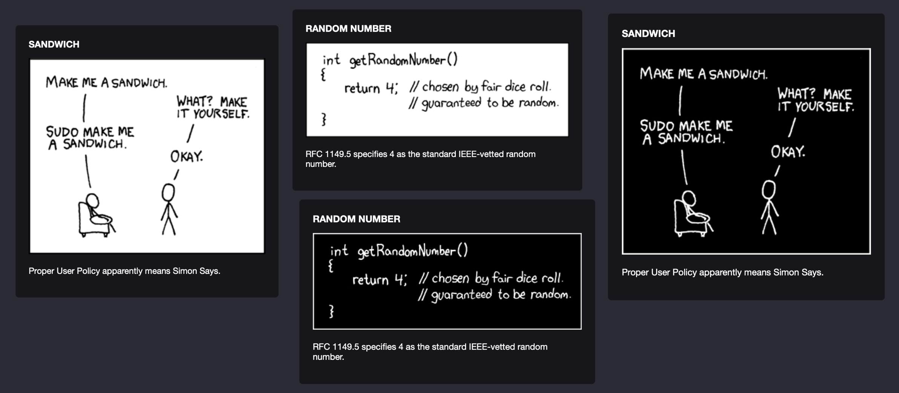

# xkcd-ultimate.widget
A responsive widget made for [Übersicht](http://tracesof.net/uebersicht/) to show either the latest or a random xkcd comic including its alt text on your desktop. This is the ultimate XKCD widget because it fixes the bugs in the existing ones by improving the parsing of the JSON and adding exception handling to handle connection drops and the macOS waking from sleep. The widget will only update the comic strip if a new comic was successfully loaded and parsed.

Other improvements to the existing widgets include:
- responsive design that adjusts the container and alt text to the comic's size
- ability to invert color of the comic to allow the widget to work for everyone prefering dark mode

## Screenshots

## Instructions
Download the **xkcd-ultimate** folder and place it in Übersicht's widgets folder
Edit the index.coffee file and adjust the following properties to your liking:
- **refreshFrequency**: how often do you want to refresh the comic (in milliseconds)
- **command**: uncomment the corresponding command to switch between latest XKCD or random XKCD
- **bottom**, top: position the widget on your desktop
- **filter**: set to invert(100%) for dark comic strips

## Sources
Based on: <a href="https://github.com/PapyPev/xkcd-random.widget">PapyPev/xkcd-random.widget on Github</a> 
Style based on DiskUsage-Bar-Widget: <a href="https://github.com/dinever/DiskUsage-Bar-Widget">Sources on Github</a>
